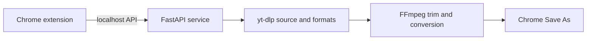

# Clip Cutter

**Trim supported video and audio sources from a Chrome popup.** Choose a time range, select a format, and save the result on your device.

Clip Cutter consists of a Chrome extension and a local Python service. The extension provides the controls; FastAPI, yt-dlp, and FFmpeg handle analysis and media processing on your computer.

> **Current setup:** This repository does not yet include a one-click installer. Start the backend from a terminal before using the extension.

## Features

- Analyze a supported media URL and inspect its duration and available video resolutions.
- Set clip boundaries with time fields or timeline sliders.
- Export video as MP4 or MOV, or audio as MP3.
- Choose an audio bitrate and use Chrome's Save As dialog to select a destination folder.
- Process media locally through a loopback-only API.

## How It Works



## Requirements

- Google Chrome
- Python 3.10 or newer
- FFmpeg and FFprobe installed and available on `PATH`
- Network access to the media source

Check that FFmpeg is available before starting:

```sh
ffmpeg -version
ffprobe -version
```

## Quick Start

### 1. Get the project

```sh
git clone https://github.com/nirobmia-40/clip-cutter.git
cd clip-cutter
```

### 2. Install backend dependencies

Linux and macOS:

```sh
cd backend
python3 -m venv .venv
source .venv/bin/activate
python -m pip install -r requirements.txt
```

Windows PowerShell:

```powershell
cd backend
py -m venv .venv
.venv\Scripts\Activate.ps1
python -m pip install -r requirements.txt
```

### 3. Start the local API

From the `backend` directory, run:

```sh
python -m uvicorn main:app --host 127.0.0.1 --port 8765
```

Leave this process running while using Clip Cutter. Confirm it is ready at [http://127.0.0.1:8765/health](http://127.0.0.1:8765/health); the response should be `{"status":"ok"}`.

### 4. Load the Chrome extension

1. Open `chrome://extensions`.
2. Turn on **Developer mode**.
3. Select **Load unpacked** and choose this repository's `extension` folder.
4. Open Clip Cutter from the Extensions menu.

## Use It

1. Paste a supported media URL and select **Analyze**.
2. Set the start and end times with the fields or timeline handles.
3. Choose **Video** or **Audio**, then select the available quality and format.
4. Keep **Choose save location** checked to open Chrome's Save As dialog, or uncheck it to use the default Downloads folder.
5. Select **Prepare download** and wait for processing to finish.

For precise video boundaries, FFmpeg re-encodes at the cuts. This can take longer than a stream-copy cut, especially at high resolutions.

## API

The service listens on `127.0.0.1:8765` and exposes:

| Method | Endpoint | Purpose |
| --- | --- | --- |
| `GET` | `/health` | Check that the local service is running |
| `POST` | `/api/analyze` | Read duration and available video resolutions |
| `POST` | `/api/download` | Create and return the selected clip |

Analysis request:

```json
{
	"url": "https://example.com/your-authorized-media"
}
```

Download request:

```json
{
	"url": "https://example.com/your-authorized-media",
	"start": 15,
	"end": 45,
	"mode": "video",
	"quality": "1080",
	"format": "mp4"
}
```

## Project Structure

```text
backend/
|-- api/          Analyze and download endpoints and request models
|-- ffmpeg/       FFmpeg availability checks
|-- media/        Source metadata and format discovery
|-- processing/   Clip ranges and audio/video options
|-- storage/      Temporary output lifecycle
|-- main.py       FastAPI application
`-- requirements.txt
extension/
|-- manifest.json Chrome extension configuration
|-- popup.html   Popup interface
|-- popup.css    Popup styles
`-- popup.js     UI and local API requests
```

## Safety and Limitations

- Only download media you own or are authorized to save, and follow the source site's terms.
- Clip Cutter does not bypass DRM or access controls.
- Supported sources depend on yt-dlp and the source site's current behavior.
- The local API is intended for this extension on the same device, not as a public server.
- A manual backend start is required in this version; a background-service installer is not included yet.